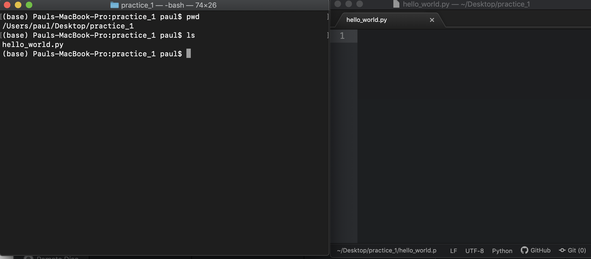
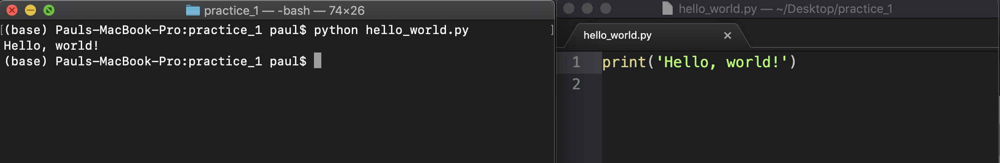

# Before class

* Feel comfortable with knowing, finding, and changing your working directory!

# Outline of class agenda

During this class you'll:
1. Learn how to create folders from the command line
2. Learn to create files from the command line
3. Get comfortable with making, editing, and running python scripts from the command line
4. Get comfortable going back and forth between the command line and your favorite text editor
 

# Class 

## 1. Making directories (folders) from the command line

To make a directory in your **current working directory**, you can run the command `mkdir` followed by the name of the folder you want to make. So if you want to make a folder called `practice_1` on the Desktop, you can run the code:

```console
$ mkdir practice_1
```

For example, if I'm in my desktop folder and run this, I can use `ls` to see that the folder has been created:


## 2. Making files from the command line

It is often really helpful to use the command line to make a new blank file that we'll open later in the text editor. For this we can use the command `touch` to make a blank file of whatever name we give it, in the current working directory

So for example, if I want to make a blank python script (just a blank text file) called `hello_world.py` in the `practice_1` folder I could:

First change directory to the folder I want to put the file in
```console
$ cd practice_1
```

Make the file
```console
$ touch hello_world.py
``` 

## 4. Editing -- between the command line and your code editor

So, we've made a python script called `hello_world.py`, but now we want to actually edit it. Often, the most effective thing to do is to open up your code editor (for this course probably [Atom](https://atom.io/) or [Sublime](https://www.sublimetext.com/)). 

It can be tricky, but it is really important to be able to locate the files you're working with from the command line in your file browser (finder/file explorer) so you can open them up with your code editor.

As an example, since `hello_world.py` for me is in a folder called `practice_1` on the desktop, I open up Atom then find the file in the file browser.


Then, when I open the file, I see something this in Atom. Now we can edit it here! A lot of the time, I like do something like this, with the command line on one side (left), and the text editor on the other (right), because we will use them together!



## 5. Running the python script

We aren't going to focus on the syntax of python code today, but to get down the workflow of how to run a python script, let's put one line in the script that says 

`print('Hello, world!')`

Make sure to save the script in Atom/Sublime!

Then, **from the command line**, you can run a python script with the `python` command. To run the `hello_world.py` script, you can run:

```console
$ python hello_world.py
```

Then, you should see the 'Hello, world!' output from your command line. 



You've just written and run your first python program! Congrats!
